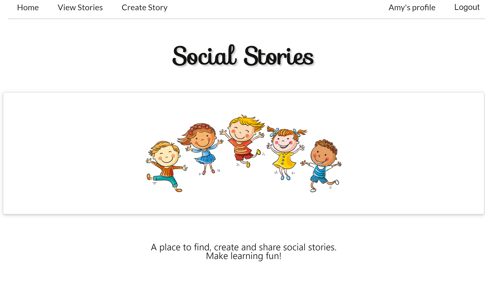
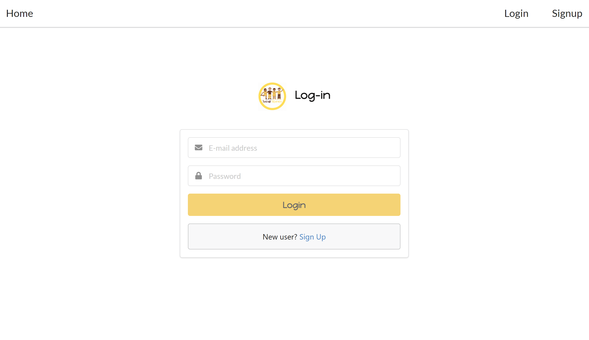
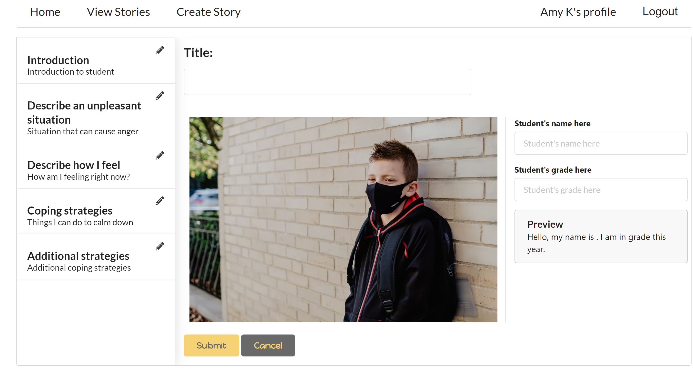
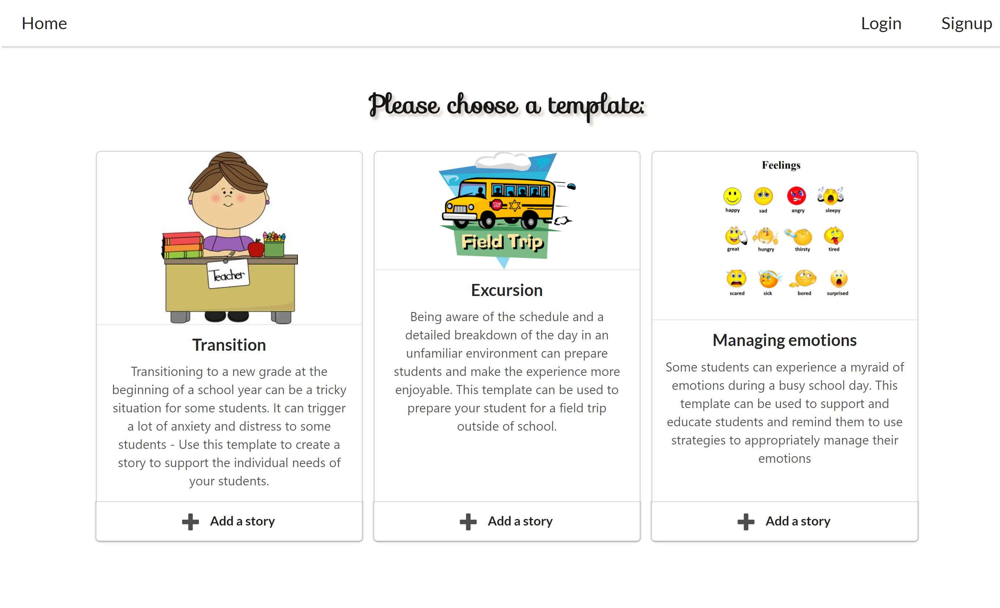

<div id="top"></div>

<div align="center">
  <a href="https://github.com/chaitra-srinivas/Social-Stories">
    
  </a>
  <h2>Social-Stories</h2>
  <h3> A place to find, create and share social stories.<h3> 
  <br>
  <a href="https://damp-gorge-33906.herokuapp.com/">See the Project!</a>
</div>

<details>
  <summary>Table of Contents</summary>
  <ol>
    <li>
      <a href="#about-the-project">About The Project</a>
      <ul>
        <li><a href="#built-with">Built With</a></li>
      </ul>
    </li>
    <li><a href="#user-stories">User Stories</a></li>
    <li><a href="#contributor">Contact</a></li>
      <li><a href="#project-links">Project Links</a></li>
    <li><a href="#installation">Installation</a></li>
    <li><a href="#questions">Questions</a></li>
    <li><a href="#license">License</a></li>
  </ol>
</details>

<div id="about-the-project"></div>

## About The Project

Social Stories are a visual aid in the form of a narrative that illustrate unfamiliar situations, help understand rules or sometimes even coach a new skill. In an educational setting, social stories are an important tool used often to help and support students deal with changes and appropriately manage their emotions and behaviour.

The Social Stories application aims to provide templates for commonly discussed concepts using which one can customize and develop a story with little effort.

Social stories is designed to allow a registered user to:

- Access available stories as inspiration to create new ones
- Customize and develop new stories using templates to suit the needs of the individual student
- Use the application as a repository to save and share stories.



<p align="right">(<a href="#top">back to top</a>)</p>

<div id="built-with"></div>

### Built With

- JavaScript
- React
- Semantic UI
- Mongo
- Mongoose
- Node.js
- Express.js
- GraphQl
- Heroku

<p align="right">(<a href="#top">back to top</a>)</p>

<div id="user-stories"></div>

## User Stories

```
AS A user who wants to create a social story

I WANT to find stories in an organized location
I WANT to explore existing stories
I WANT to save and share my stories
I WANT to create new stories using templates

SO I can develop a story at a short notice
```

```
AS A user who wishes to create stories

I WANT to be able to view a list of stories created by me in my profile page
I WANT to be able to edit and update a story created by me
I WANT to have the ability to delete a story create by me

SO I have the ability to utilize my data as required
```

```
AS A user who wants their information secure

I WANT to be promted to sign up the first time I enter the site
I WANT to be able to login securely with my login details
I WANT to logout when my session is finished

SO THAT my personal information is secure and my data is saved
```

<p align="right">(<a href="#top">back to top</a>)</p>

<div id="contributor"></div>

## Contact:

- Chaitra - https://github.com/chaitra-srinivas ·

<p align="right">(<a href="#top">back to top</a>)</p>

<div id="proj-func"></div>

Some images from the application to deomonstrate funtionality:





<p align="right">(<a href="#top">back to top</a>)</p>

<div id="project-links"></div>

## Project Links

Project Link: https://github.com/chaitra-srinivas/Social-Stories <br/>
Deployed application: https://damp-gorge-33906.herokuapp.com/

<p align="right">(<a href="#top">back to top</a>)</p>

<div id="installation"></div>

### Installation

To get a local copy up and running please follow these steps.

1. Clone the repo
   ```sh
   git clone git@github.com:chaitra-srinivas/Social-Stories.git
   ```
2. Install NPM packages
   ```sh
   npm install
   ```
3. Run on local server
   ```sh
   npm run develop
   ```

<p align="right">(<a href="#top">back to top</a>)</p>

<div id="questions"></div>

## Questions

If you have a suggestions/questions regarding the project please contact me @ cmurthy.dev@gmail.com

<p align="right">(<a href="#top">back to top</a>)</p>

<div id="licence"></div>

## License

Distributed under the MIT License. .

<p align="right">(<a href="#top">back to top</a>)</p>
